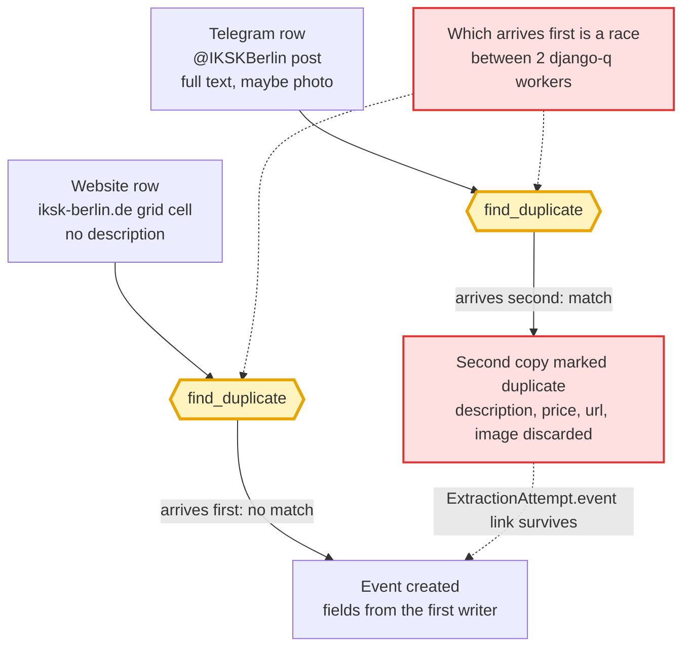
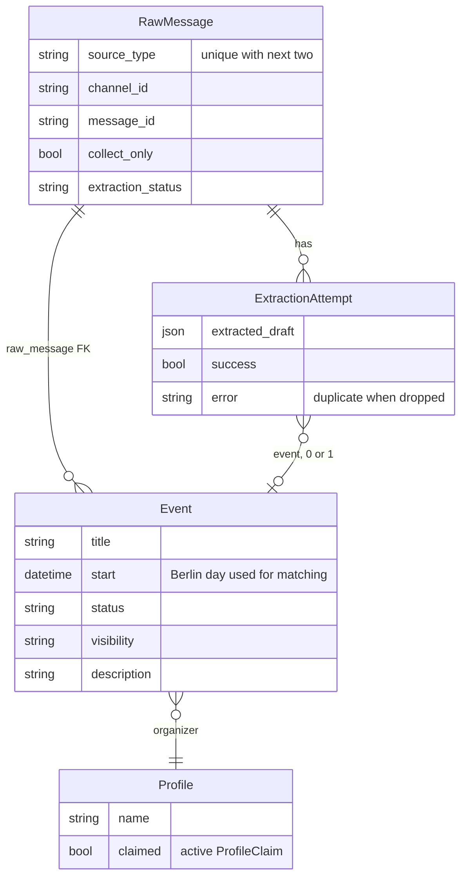

# How an event gets collected

This page shows how an event announcement travels from a website or Telegram channel to the public events list. It focuses on the two places where the system decides two posts are the same thing. Read it to reason about how matching and de-duplication should work.

## A. The journey of one post

Yellow marks the two de-duplication gates. Red marks where the IKSK website description is lost.

```mermaid
flowchart LR
  S["Source<br/>website page or Telegram post"] --> C["switch-cli collect<br/>writes a rows file"]
  C --> P["collect push"]
  P --> API["POST /api/ingest/raw-messages"]
  API --> RM{{"RawMessage row<br/>GATE 1: same post seen before?"}}
  RM -->|"new"| Q["django-q task"]
  RM -->|"seen"| AC["already_collected<br/>nothing happens"]
  Q --> ENR["URL enrichment<br/>fetch linked pages"]
  ENR --> LUNA["Luna reads text and photos<br/>returns a list of event drafts"]
  LUNA -->|"empty list"| WIPE["Not an event<br/>row wiped"]
  LUNA --> D1["For each draft: past?"]
  D1 -->|"no"| D2["not Berlin?"]
  D2 -->|"no"| D3["low confidence?"]
  D3 -->|"no"| DUP{{"GATE 2: DUPLICATE?<br/>same day and similar title"}}
  DUP -->|"no match"| ORG["organizer known?"]
  DUP -->|"match"| DROP["Dropped<br/>fields discarded"]
  ORG --> PUB["publish by claim state<br/>unclaimed: published<br/>claimed: draft"]
  PUB --> EV["Event<br/>public or semi_public"]
  EV --> VIS["/events visible_to"]
  GRID["IKSK website reads only the grid cell<br/>detail page never fetched"] -.-> LOST["Description lost<br/>link redirects, enrichment refuses it"]
  S -.-> GRID
  LOST -.-> ENR
  classDef gate fill:#fff3bf,stroke:#e8a400,stroke-width:3px
  classDef bug fill:#ffe0e0,stroke:#d33,stroke-width:2px
  class RM,DUP gate
  class GRID,LOST bug
```

## B. Two sources, one event: what happens today

## C. How the records relate

An event links to its organizer through a small link table (EventOrganizer), drawn here as a plain link.

## Puzzle pieces

| Piece | What it is | Where |
|---|---|---|
| Rows file | The list of posts one collector run gathered, saved as a file before sending. | `tools/switch-cli/src/switch_cli/collect.py:56` |
| IKSK website reader | Reads the program grid: time, title, link per cell. Never opens the detail page. | `tools/switch-cli/src/switch_cli/collect.py:81` |
| Karada reader | Reads the events API. The description comes inline, up to 3000 characters. | `tools/switch-cli/src/switch_cli/collect.py:116` |
| Telegram post folding | Photos posted as one album count as one post. The post id is the first message's id. | `tools/switch-cli/src/switch_cli/telegram/read.py:81` |
| Source list | Which sites and channels we collect, their kind, and the collect-only switch. | `tools/switch-cli/collector_sources.toml` |
| Nightly run | At 04:00: collect web, collect telegram, push, then wait for extraction to finish. | `tools/switch-cli/nightly/collect-nightly.sh:99` |
| Ingest endpoint | Staff-only door that stores each row and queues extraction. | `syndication/api.py:1493` |
| RawMessage | One stored post. Unique per source, channel and post id, so a repeat is ignored (gate 1). | `ingestion/models.py:5 (constraint 47)` |
| Row ingest | Tries to store each row; a repeat counts as already_collected. | `ingestion/collected.py:39` |
| Task | Background job: enrich, extract, then land each event. | `ingestion/tasks.py:12` |
| URL enrichment | Fetches pages linked in the post. Refuses redirects as a safety rule. | `ingestion/enrichment.py:64` |
| Luna extraction | The AI reads text and photos and returns a list of drafts. Empty list means not an event. | `ingestion/extraction.py:95` |
| Event draft | One event as the AI read it: title, start, price, link, confidence, Berlin flag. | `ingestion/schemas.py:6` |
| Landing checks | Per draft, in order: past, not Berlin, low confidence, duplicate, organizer known. | `ingestion/collected.py:180` |
| Duplicate finder | Same Berlin day and title similarity of at least 0.4. Best match wins (gate 2). | `ingestion/collected.py:118` |
| Publish by claim state | Organizer unclaimed: publish now. Claimed: keep as draft for the manager. | `syndication/authz.py:56` |
| Visibility tier | Website and public Telegram channels give public. Private sources give semi_public. | `events/backfill_visibility.py:36, 47` |
| Event | The listing itself. Links back to the post it came from. | `events/models.py:111 (raw_message 323)` |
| Who sees what | Visitors see public only. Trusted members add semi_public. Staff see all. | `events/managers.py:30` |

## The matching rule today, in words

- An event is a duplicate when another live event falls on the same Berlin calendar day and its title is similar enough (trigram score of at least 0.4).
- If several match, the most similar one is kept as the original.
- The new copy is marked duplicate and points at the original. None of its fields are written.
- The first copy to arrive wins, whatever its source or quality.

Also true today:

- Raw level: re-collecting the same post is ignored. The two IKSK sources (website and Telegram) never collide here, each makes its own RawMessage.
- IKSK website events land with an almost empty description (bug sb-7wzb.15). Karada does not have this problem.

Three known weaknesses:

1. Same-day title similarity is untested at scale. Two different events on one day with similar titles can be wrongly merged.
2. First writer wins, and the order is a race between two background workers. The richer source can lose.
3. A dropped copy loses its fields. The IKSK Telegram post may carry the description that the website copy lacks, and it is thrown away.

**Open question for the owner: drop, rank, or fill-empty merge?**
